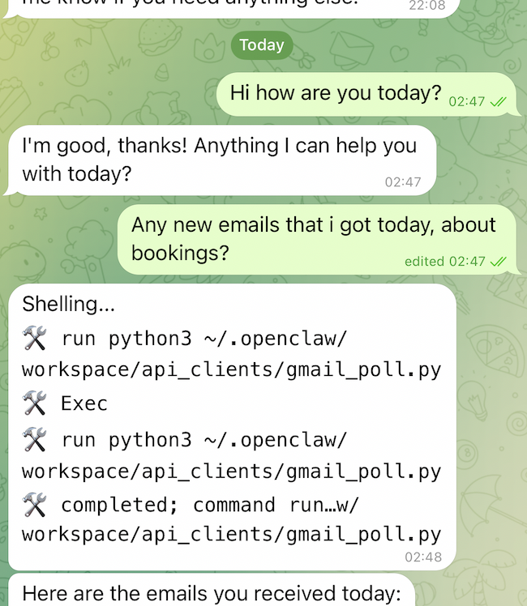
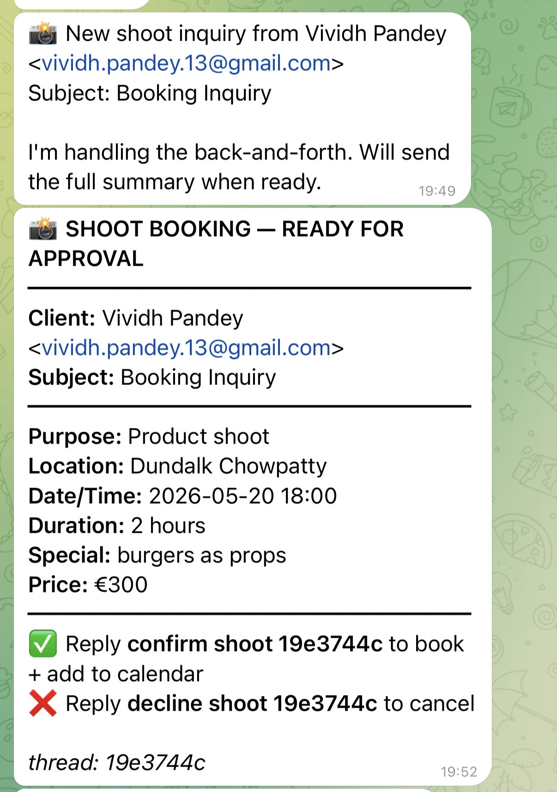
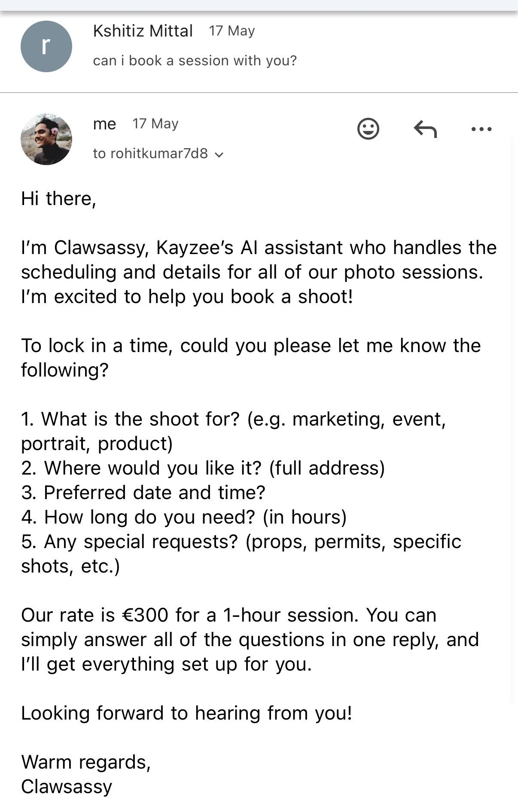

# clawSaas

> The AI sidekick your inbox has been begging for. Reads your messages, drafts the reply, books the gig — while you're out doing actual work.

clawSaas is an AI operations engine for local service businesses and creators who don't have time to live at a laptop. It watches every channel a real business uses (Gmail, Instagram DMs, Google Calendar, customer reviews), drafts the replies, books the appointments, fends off the spam, and only buzzes you when a human decision is actually needed.

🌐 **Live site:** [lefotugrapher.github.io/clawsaas](https://lefotugrapher.github.io/clawsaas/)
📄 **Full project context:** [docs/clawSaas-Project.pdf](docs/clawSaas-Project.pdf)

---

## See it in action

**Booking a shoot via Gmail — fully autonomous.** A client emails asking to book; Clawsassy replies with all the questions in one go.



**The summary on Telegram when all answers are in.** One tap to confirm and book the calendar event.



**Natural-language Telegram chat with the assistant.** Ask anything; it runs the right script and replies.



---

## What's in this repo

This repo hosts the **public-facing site + legal documents** for clawSaas. The product itself lives in a separate workspace on the user's own Mac.

```
.
├── index.html             — landing page
├── privacy.html           — GDPR-compliant privacy policy (Ireland)
├── terms.html             — terms of service
├── data-deletion.html     — data deletion instructions
├── docs/
│   └── clawSaas-Project.pdf  — full project context (architecture, roadmap, business model)
└── screenshots/           — product screenshots
```

---

## Hosting

The site is served by GitHub Pages from the `main` branch root and is reachable at:

```
https://lefotugrapher.github.io/clawsaas/
```

The three legal URLs are required fields in the Meta Developer dashboard for App Review.

---

## Status (as of May 2026)

- Gmail watcher with AI triage: **live**
- Autonomous shoot-booking flow: **live**
- Google Calendar integration: **live**
- Daily 7 AM briefing: **live**
- Instagram DM watcher: **live in dev mode**, awaiting Meta App Review
- Health monitoring: **live**

Built in Dublin by [@lefotugrapher](https://github.com/lefotugrapher). Contact: mittalkshitiz13@gmail.com
